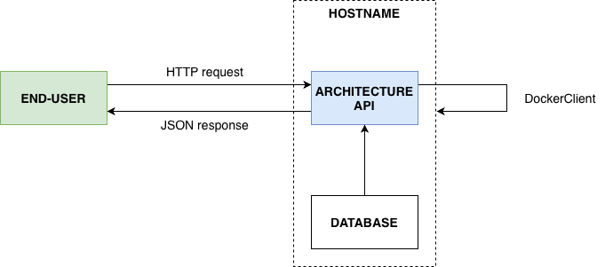
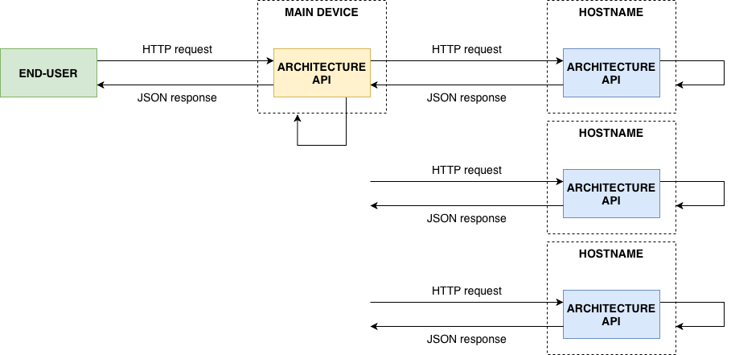

# Architecture API {#sec:projects_architecture_api level=sec status=ready}

Author: Johannes Boghaert - ETHZ

Maintainer: Johannes Boghaert - ETHZ

This section of the book will introduce the architecture API in Duckietown. The architecture API is a Docker module that will be running by default on any device in Duckietown. Through HTTP requests and JSON response messages, the system architecture of a fleet or single robot can be controlled and monitored.

A more detailed overview and design approach to the architecture API can be found in the respective [Design Document](https://ethidsc.atlassian.net/wiki/spaces/DS/pages/458719261/Design+Document+The+Architecture+API).

<minitoc/>

## Introduction {#introduction-architecture-api}
Before moving to the details of the architecture API, the following definitions
and naming conventions should be familiarized by the reader:

- module: a Docker container.
- configuration: the system architecture (replacing demo and stack) of a device or fleet, could be lane-following, obstacle-avoidance, localization, etc.
- robot: any Duckietown device.
- fleet: a series of Duckietown devices, not necessarily of the same type.

The architecture API is a module running on any Duckietown device (i.e. it is
uniform in its design). The module uses the [DockerClient function](https://docker-py.readthedocs.io/en/stable/client.html) to manage the configuration of the host
device, i.e. to start, create or stop modules. The architecture API module - and
therefore the device architecture - can be controlled using an HTTP request on the
local network. Every request returns a [JSON](https://www.json.org/json-en.html)
response message reflecting the system progress on the request. The design
approach and development choices are explained in more detail in the [Design Document](https://ethidsc.atlassian.net/wiki/spaces/DS/pages/458719261/Design+Document+The+Architecture+API).

<figure id="single_overview">
    <figcaption>Systematic overview of the Architecture API functioning for single device control</figcaption>
    
</figure>

The above introduction on the API functioning allows us to expand from individual
device architecture control to fleet architecture control. Designating and
allowing a main device, the architecture API could control a fleet by sending
various sub-HTTP requests depending on the HTTP request from the end-user, using
the [Python request function](https://requests.readthedocs.io/en/master/).

<figure id="multi_overview">
    <figcaption>Systematic overview of the Architecture API functioning for a fleet controlling main device</figcaption>
    
</figure>

## When to use the architecture API {#when-to-use}
The architecture API can be used for the control and monitoring of the
configuration of any number of robots of any robot type. Before June 2020, the
*Duckietown Shell* was used to launch various demos such as lane_following and
indefinite_navigation. For a fleet of `N` Duckiebots, launching the required 3
times `N` as defined in the [Docs](https://docs.duckietown.org/daffy/downloads/opmanual_duckiebot/docs-opmanual_duckiebot/builds/762/opmanual_duckiebot/out/demo_lane_following.html) can become a time-consuming activity.
The architecture API resolves the complexity of this procedure by launching
configurations using a single HTTP request only. Furthermore, it facilitates
general fleet control from a designated main Duckietown device, e.g. a town for
the *Town as a Robot* scenario.

The architecture API module thus partially replaces the Duckietown Shell, i.e. by
launching various demos on a Duckietown device or Duckietown fleet in a more
uniform and modular manner that can be re-used for any configuration.

## What it consists of {#what-it-consists-of}
The architecture API consists of a [database](https://github.com/duckietown/dt-architecture-data/tree/ente) containing information on
the various modules and configurations that can be launched on a device. This
allows the user to quickly modify any configuration file, while not being exposed
to the code of the API itself. The various functions of the API are stored as a
Python library in the [dt-commons repository](https://github.com/duckietown/dt-commons/tree/ente) for reusability and
logic-decoupling purposes. This allows the [architecture API module](https://github.com/duckietown/dt-architecture-api) to be
easily interpretable, only specifying the API communication details (e.g. port  
or DockerClient).

### dt-architecture-data {#database}
This repository contains a [modules folder](https://github.com/duckietown/dt-architecture-data/tree/ente/modules) with configuration-
independent information on the possible modules in Duckietown.

The structure of a module file is as follows:
```
version: '1'

description: 'a brief description of what the module does'
icon: an icon from ![fontawesome.com]
functionalities:
  - 'a list of functionalities of the module'
  - 'written as: the module ![name] allows you to ![functionality]'

configuration:
  image: duckietown/dt-core:daffy-${ARCH-arm32v7}
  restart: unless-stopped
  network: host
  ports:
    - "8082:8082/tcp"
  volumes:
    - /data:/data
    - /etc/avahi/services:/etc/avahi/services
```

The item *configuration* is a YAML object fully compatible with the function
`docker.containers.run()` in the [Docker SDK for Python](https://docker-py.readthedocs.io/en/stable/containers.html#docker.models.containers.Container.reload).

The repository also contains a configuration folder with information on which
modules a certain configuration should contain, per device type. Any other
information, or configuration-dependent commands for a module can be specified
here as well. This allows to use the modules as uniform building blocks for any
configuration, where other `docker.containers.run()` commands can be specified.

The structure of a configuration file is as follows:
```
version: '1'

description: 'A brief description of what the configuration does'
modules:
  dt-town-interface:
    type: dt-town-interface
    required: true
    unique: true
  device-health:
    type: dt-device-health
    required: true
    unique: true
    command: roslaunch ![package] ![file].launch

devices:
  duckiebot:
    configuration: joystick
  watchtower:
    configuration: demo-simple
```

The item *devices* is only read when a configuration request for fleet control is
called - i.e. a `/fleet/` endpoint. This item lists the configurations that are
required for the various device types in the fleet. The item *modules* lists the
modules that will run on the main device in order to get to the corresponding
configuration. The item *type* refers to a module name listed in the module
folder. Note that the item *command* is fully optional, and is a configuration-
dependent entry for the `device-health` module, compatible with the
`docker.containers.run()` function aforementioned.

**Note:** It is not possible to have two different configurations running on a
single device, nor is it possible to run more than one configuration on a single device type - and therefore device.

### dt-commons {#library}

- **dt_arch_api_utils:** this library is part of the `dt-commons` [repository](https://github.com/duckietown/dt-commons/tree/ente) and contains the elementary functions for the single-device control part of the architecture API. It consists of an `ArchitectureAPIClient` class which is used for the actual API to work, but does not provide the server itself or any DockerClient specification.

- **dt_multi_arch_api_utils:** the `MultiArchitectureAPIClient` class extends the functionalities of the `ArchitectureAPIClient` class to be able to communicate with multiple devices over the local network at virtually the same moment. It therefore is able to send out HTTP requests using Python functionalities, used to both activate configurations and monitor the status of these configurations on various devices.

### dt-architecture-api {#api}
This module is built as a REST API and is responsible for reading the
aforementioned repositories and files from the SD card (while constantly watching
for changes to the files and repos on the disc and Github). By using the
aforementioned libraries, the module can monitor the current status of the local
system (e.g., which containers are running, which images are available, etc.) by
using the Python SDK for Docker. In essence, the API will only feature a server.py
file which makes use of the functions in the dt-commons libraries. This file will
connect the various HTTP request endpoints to the functions in these libraries,
and will further define the required DockerClient, port, and other.

In short, an HTTP API will allow us to query, update and monitor the
configurations the robot is in at any given time. The envisioned endpoints are
listed in [](#arch-api-get-started).

## How to start {#arch-api-get-started}
As the architecture API is not yet included as default module on a Duckietown
device, the architecture API can be build manually by following the next steps:

### Building the Python library {#build-lib}
Fork or clone the latest `duckietown/dt-commons` Github repository. Then build the `dt-commons` module that includes the library on your device:

    laptop $ dts devel build --arch arm32v7 -H ![HOSTNAME].local

### Building the architecture API module {#build-api}
Fork or clone the latest `duckietown/dt-architecture-api` Github repository. Then build the architecture API on your device:

    laptop $ dts devel build -f --arch arm32v7 -H ![HOSTNAME].local

Now run the architecture API on your device:

    laptop $ docker -H ![HOSTNAME].local run -it --rm --network="host" -e DEBUG=1 -v /data:/data -v /var/run/avahi-daemon/socket:/var/run/avahi-daemon/socket -v /var/run/docker.sock:/var/run/docker.sock duckietown/dt-architecture-api:VERSION-arm32v7

The module should start running in debug (a.k.a. developer) mode.

### Controlling the Architecture API {#control-api}
With a successful launch of the architecture API module and inclusion of the
necessary libraries, the following HTTP template request can be entered in any
browser followed by one of the endpoints found below, and will return a specific JSON response message:

    http:// ![HOSTNAME].local:8083![endpoint]

<div figure-id="tab:api-endpoints-tab" markdown="1">
  <style>
    td:nth-child(2) {
    white-space: pre;
   }
  </style>
  <col3 class="labels-row1" >
    <span>Single or multi</span>
    <span>Endpoint</span>
    <span>Explanation of response message</span>
    <span>`/device`</span>
    <span>`/`</span>
    <span>Default response for single device control</span>
    <span>`/device`</span>
    <span>`/configuration/list`</span>
    <span>List possible configurations for the device in use</span>
    <span>`/device`</span>
    <span>`/configuration/info/![config]`</span>
    <span>Detailed information on a specific configuration</span>
    <span>`/device`</span>
    <span>`/configuration/set/![config]`</span>
    <span>Launch a specific configuration on the device in use</span>
    <span>`/device`</span>
    <span>`/module/list`</span>
    <span>List possible modules</span>
    <span>`/device`</span>
    <span>`/module/info/![mod]`</span>
    <span>Detailed information on a specific module</span>
    <span>`/device`</span>
    <span>`/monitor/![ETag]`</span>
    <span>Monitor the progress of the request</span>
    <span>`/fleet`</span>
    <span>`/`</span>
    <span>Default response for a fleet controlling main device</span>
    <span>`/fleet`</span>
    <span>`/configuration/list/![fleet]`</span>
    <span>List possible configurations for the fleet and device in use</span>
    <span>`/fleet`</span>
    <span>`/configuration/info/![config]`</span>
    <span>Detailed information on a specific configuration for the fleet and device in use</span>
    <span>`/fleet`</span>
    <span>`/configuration/set/![config]/![fleet]`</span>
    <span>Launch a specific configuration on the fleet and device in use</span>
    <span>`/fleet`</span>
    <span>`/monitor/![ETag]/![fleet]`</span>
    <span>Monitor the progress of the request for fleet and device in use</span>
    <span>`/fleet`</span>
    <span>`/info/![fleet]`</span>
    <span>Information on the devices that are specified in the fleet file</span>
  </col3>
  <figcaption>Architecture API endpoints</figcaption>
</div>


## Future outlook {#api-future-outlook}
For a detailed description of the development and future outlook of the
architecture API functioning, see the respective [Design Document](https://ethidsc.atlassian.net/wiki/spaces/DS/pages/458719261/Design+Document+The+Architecture+API)
on the architecture API.

## Hands on {#api-hands-on}
Build the architecture API module as instructed in [](#arch-api-get-started).
Make sure everything works as expected by launching the *demo-simple*
configuration on your Duckiebot and checking if the corresponding modules of this
configuration are running using *portainer* or `docker ps`.

**Congratulations!** You now successfully launched various modules using the
architecture API, that together launch the demo-simple configuration on your
Duckiebot!

## Ask the community {#api-ask}
If you need any help with the use of the architecture API module in Duckietown,
join the slack channel [autolab-development](https://duckietown.slack.com/archives/CUWJBBEJX).
